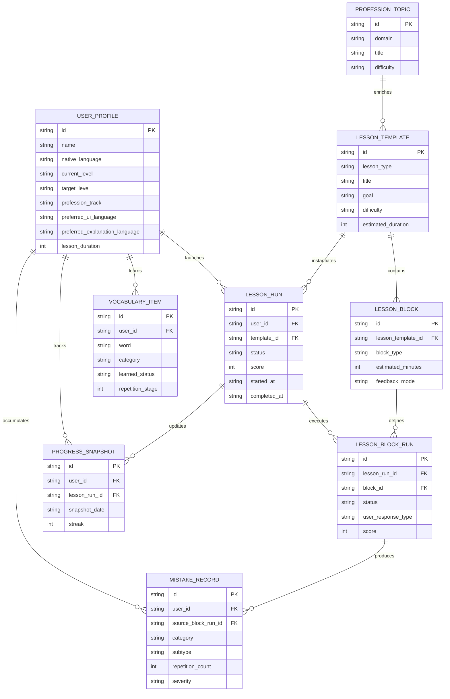

# ER Model

## Scope

Эта ER-модель фиксирует MVP storage-ядро для:

- user profile и preferences
- lesson templates и lesson runs
- execution of lesson blocks
- mistake analytics
- progress snapshots
- vocabulary retention
- professional content mapping

## Separation Principle

- `content entities` описывают учебный контент и lesson templates
- `runtime entities` фиксируют конкретные попытки пользователя
- `analytics entities` агрегируют ошибки, прогресс и интервальные повторы

## Mermaid ER Diagram

## Entity Notes

### USER_PROFILE

- один пользователь = один активный профиль
- хранит onboarding, goals, language preferences и приоритеты
- не должен содержать историю уроков напрямую

### LESSON_TEMPLATE

- это content entity
- хранит шаблон урока, а не конкретный запуск
- lesson builder может собрать runtime lesson на основе template + weak spots + priorities

### LESSON_BLOCK

- является частью template
- payload зависит от `block_type`
- порядок блоков хранится на уровне lesson template

### LESSON_RUN

- отдельный runtime instance урока
- нужен для истории, streak, analytics и повторного просмотра результатов

### LESSON_BLOCK_RUN

- granular execution-слой
- связывает пользовательский ответ, транскрипт, feedback и scoring с конкретным block instance

### MISTAKE_RECORD

- агрегированная сущность ошибки
- источник ошибки может ссылаться на `lesson_block_run`
- repetition count растёт при повторных совпадениях

### PROGRESS_SNAPSHOT

- моментальный срез по skills
- полезен для weekly/monthly charts
- может быть привязан к lesson run, но не обязан

### VOCABULARY_ITEM

- поддерживает интервальные повторения
- может рождаться из lesson blocks, mistakes и profession content

### PROFESSION_TOPIC

- content entity для insurance, banking, trainer skills, regulation, AI business
- lesson templates могут ссылаться на topic id, не копируя весь контент в каждый урок

## MVP Persistence Recommendation

- SQLite tables для runtime и analytics entities
- JSON fields допустимы для lesson block payload и flexible metadata
- content templates можно сначала держать в JSON/Python configs, а позже перенести в БД

